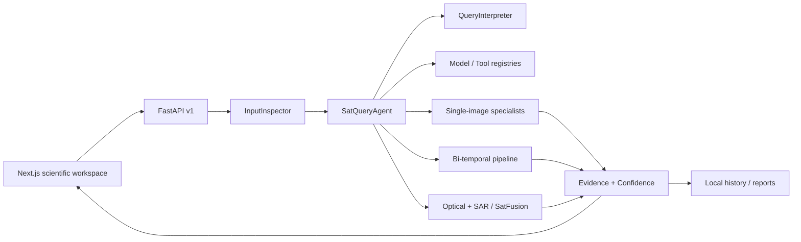

# SatQuery AI

SatQuery AI is a local-first, sensor-aware assistant for remote-sensing image analysis. It inspects raster inputs, interprets natural-language questions, selects specialist workflows, produces spatial evidence, calculates evidence-derived confidence, records an observable execution trace, and generates a local report.

Built for Smart India Hackathon / ISRO–Department of Space problem statement **26167**.

> Research prototype: the included deterministic baselines make the entire workflow demoable without downloading large checkpoints. Learned-model fallbacks are always labeled **Development Mock Result** and benchmark pages never show invented scores.

## What works now

- Three exact modes: single image, bi-temporal pair, and optical + SAR pair.
- GeoTIFF/TIFF inspection with CRS, affine transform, bounds, resolution, NoData, bands and pair compatibility when Rasterio metadata is available.
- PNG/JPEG benchmark-image support with explicit pixel-space labeling.
- Rule-based query interpretation across the 14 specified intents.
- Central model and tool registries with checkpoint status and device reporting.
- Single-scene caption/VQA/grounding development flow backed by real pixel-derived land-cover evidence.
- Bi-temporal pixel-change heatmap, overlay, class deltas and structured change reasoning.
- Optical and SAR evidence extraction plus weighted SatFusion baseline and agreement confidence.
- Leaflet `CRS.Simple` viewer with zoom, pan, fit, pair split, evidence selection and opacity.
- Local JSON history, HTML report generation, health/models/history/benchmark routes.
- Frozen RemoteCLIP + trainable bottleneck adapter pipeline for BigEarthNet subsets.
- Reusable evaluation metrics and deterministic synthetic demo imagery generator.

## Architecture



The design principle is: **specialist models perform perception; the agent performs orchestration; the evidence engine performs validation and integration.** See [docs/architecture.md](docs/architecture.md).

## Prerequisites

- Node.js 20.9+ (tested with Node 24)
- Python 3.9+
- macOS, Linux or Windows; CUDA and Apple MPS are detected when available
- GDAL-compatible Rasterio wheel/system library for GeoTIFF support

## Local setup

```bash
cp .env.example .env
python3 -m venv .venv
source .venv/bin/activate
pip install -r apps/api/requirements.txt
npm install
```

Terminal 1:

```bash
cd apps/api
../../.venv/bin/uvicorn app.main:app --reload --host 127.0.0.1 --port 8000
```

Terminal 2:

```bash
cd apps/web
npm run dev
```

Open [http://localhost:3000](http://localhost:3000). API documentation is at [http://127.0.0.1:8000/docs](http://127.0.0.1:8000/docs).

## Demo data

Generate legal, deterministic synthetic scenes:

```bash
.venv/bin/python scripts/generate_demo_data.py
```

Then demonstrate:

1. `demo/single/agriculture-river.png` → “Highlight the largest water body.”
2. `demo/change/t1.png` + `t2.png` → “Has the built-up area increased?”
3. `demo/cross_modal/optical.png` + `sar.png` → “Use both sensors to identify water-covered areas.”

The classical outputs are genuine computations over those pixels. GeoChat, RemoteCLIP and ChangeFormer entries remain `checkpoint_missing` until configured.

## Model checkpoints

Large files are ignored. Place local checkpoints as documented in [models/README.md](models/README.md). The model manager supports CPU/CUDA/MPS selection, lazy interfaces and post-request memory cleanup.

## Domain adaptation

The `ml/training/remote_adapter` pipeline freezes a local RemoteCLIP/CLIP-compatible vision encoder and trains only a residual bottleneck adapter plus multi-label head on a user-provided BigEarthNet subset.

```bash
python ml/training/remote_adapter/train.py \
  --dataset-path datasets/BigEarthNet-S2 \
  --epochs 8 --batch-size 24 --device auto \
  --output-dir ml/training/outputs/satquery-adapter
```

It writes `best.pt`, `latest.pt`, configuration, and measured training/validation metrics. Use `encoder_backend: spectral` only to smoke-test plumbing; it is not a substitute for the required RemoteCLIP adaptation run. See [docs/dataset-setup.md](docs/dataset-setup.md).

## Tests and builds

```bash
.venv/bin/python -m pytest apps/api/tests
npm --workspace apps/web run lint
npm --workspace apps/web run build
```

## Repository map

```text
apps/web                 Next.js workspace and research pages
apps/api/app             FastAPI, agent, registries, services and raster tools
ml/training              Remote-sensing adapter training
ml/evaluation            Reusable measured metrics
packages/shared-types    Cross-surface mode and intent definitions
data                     Ignored local uploads, outputs, reports and history
models                   Ignored local model checkpoints
datasets                 User-provided benchmark/training datasets
demo                     Generated synthetic demo scenes
docs                     Architecture, setup, evaluation and limitations
```

No deployment, authentication, paid API or cloud database is required or configured.
