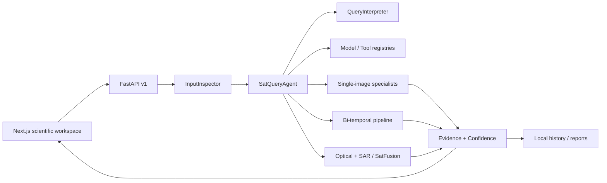

# SatQuery AI

SatQuery AI is a local-first, sensor-aware assistant for remote-sensing image analysis. It inspects raster inputs, interprets natural-language questions, selects specialist workflows, produces spatial evidence, calculates evidence-derived confidence, records an observable execution trace, and generates a local report.

Built for Smart India Hackathon / ISRO–Department of Space problem statement **26167**.

> Research prototype: the application supports real local RemoteCLIP, a trained EuroSAT adapter, and official ChangeFormer inference when their ignored checkpoints are installed. Deterministic fallbacks remain available through `MOCK_MODE=true`, are always labeled **Development Mock Result**, and benchmark pages never show invented scores.

## What works now

- Three exact modes: single image, bi-temporal pair, and optical + SAR pair.
- GeoTIFF/TIFF inspection with CRS, affine transform, bounds, resolution, NoData, bands and pair compatibility when Rasterio metadata is available.
- PNG/JPEG benchmark-image support with explicit pixel-space labeling.
- High-precision composite-figure screening that pauses inference on paper graphics/screenshots and requests the original raster panels.
- Rule-based query interpretation across the 14 specified intents.
- Central model and tool registries with checkpoint status and device reporting.
- Learned RemoteCLIP RN50 scene captioning, query answering and patch-level grounding.
- A trained residual adapter over frozen RemoteCLIP features using 5,000 balanced EuroSAT RGB samples.
- Mutually exclusive normalized land-cover shares, caption/evidence consistency scoring, and an explicit ceiling on uncalibrated learned confidence.
- Target-aware hybrid change inference: official ChangeFormer V6 for structural evidence plus appearance and land-cover transitions for water, vegetation and other environmental change.
- Learned optical evidence plus SAR backscatter/texture extraction and a replaceable weighted SatFusion baseline.
- Full-resolution overlapping tile inference with stitched outputs; browser previews are downsampled separately.
- GeoTIFF pair reprojection onto a shared grid, with an explicit pixel-space fallback for unreferenced images.
- Non-blocking local analysis jobs with progress polling and all required job states.
- Leaflet `CRS.Simple` viewer with zoom, pan, fit, pair split/swipe, evidence selection, overlay toggle and opacity.
- Local JSON history, HTML report generation, health/models/history/job/benchmark routes.
- Frozen RemoteCLIP + trainable bottleneck adapter pipeline for EuroSAT or manifest-backed BigEarthNet subsets.
- Reusable evaluation metrics and deterministic synthetic demo imagery generator.

## Architecture



The design principle is: **specialist models perform perception; the agent performs orchestration; the evidence engine performs validation and integration.** See [docs/architecture.md](docs/architecture.md).

## Prerequisites

- Node.js 20.9+ (tested with Node 24)
- Python 3.9+
- macOS, Linux or Windows; CUDA and Apple MPS are detected when available
- GDAL-compatible Rasterio wheel/system library for GeoTIFF support

## Local setup

```bash
cp .env.example .env
python3 -m venv .venv
source .venv/bin/activate
pip install -r apps/api/requirements.txt
npm install
```

Terminal 1:

```bash
cd apps/api
../../.venv/bin/uvicorn app.main:app --reload --host 127.0.0.1 --port 8000
```

Terminal 2:

```bash
cd apps/web
npm run dev
```

Open [http://localhost:3000](http://localhost:3000). API documentation is at [http://127.0.0.1:8000/docs](http://127.0.0.1:8000/docs).

## Demo data

Generate legal, deterministic synthetic scenes:

```bash
.venv/bin/python scripts/generate_demo_data.py
```

Then demonstrate:

1. `demo/single/agriculture-river.png` → “Highlight the largest water body.”
2. `demo/change/t1.png` + `t2.png` → “Has the built-up area increased?”
3. `demo/cross_modal/optical.png` + `sar.png` → “Use both sensors to identify water-covered areas.”

With `MOCK_MODE=true`, the classical outputs are genuine computations over those pixels and carry the development label. After model setup, set `MOCK_MODE=false` to run RemoteCLIP, the trained adapter and ChangeFormer locally. GeoChat remains an optional interchangeable VLM rather than a runtime dependency.

## Model checkpoints

Large files are ignored. Run `scripts/setup_local_models.sh` or place checkpoints manually as documented in [models/README.md](models/README.md). The model layer supports CPU/CUDA/MPS selection, lazy loading and post-request memory cleanup.

## Domain adaptation

The `ml/training/remote_adapter` pipeline freezes RemoteCLIP RN50 and trains only a residual bottleneck adapter plus classification head. The included preparation flow uses the open EuroSAT RGB dataset; the same JSONL manifest contract also supports BigEarthNet subsets.

```bash
.venv/bin/python scripts/prepare_eurosat_manifest.py --max-samples 5000
.venv/bin/python ml/training/remote_adapter/train.py \
  --dataset-path datasets/EuroSAT_RGB \
  --epochs 5 --batch-size 32 --device auto \
  --output-dir ml/training/outputs/satquery-adapter
mkdir -p models/satquery-adapter
cp ml/training/outputs/satquery-adapter/best.pt models/satquery-adapter/best.pt
```

The completed 5,000-sample run produced a measured 750-image holdout result of **89.7% accuracy** and **89.5% macro-F1**. These values come from `evaluation-results/domain-adapter.json`; they are not hard-coded UI data. Use `encoder_backend: spectral` only to smoke-test plumbing. See [docs/dataset-setup.md](docs/dataset-setup.md).

## Measured evaluation

The repository currently contains two local evaluation records:

- EuroSAT adapter: 750-image deterministic holdout from the 5,000-sample training manifest.
- ChangeFormer: seven official LEVIR-CD demo pairs bundled with the upstream ChangeFormer source; this is a smoke benchmark, not a full-dataset claim.

Re-run ChangeFormer evaluation with:

```bash
.venv/bin/python ml/evaluation/evaluate_changeformer.py --device auto
```

## Tests and builds

```bash
.venv/bin/python -m pytest apps/api/tests
npm --workspace apps/web run lint
npm --workspace apps/web run test
npm --workspace apps/web run build
```

## Repository map

```text
apps/web                 Next.js workspace and research pages
apps/api/app             FastAPI, agent, registries, services and raster tools
ml/training              Remote-sensing adapter training
ml/evaluation            Reusable measured metrics
packages/shared-types    Cross-surface mode and intent definitions
data                     Ignored local uploads, outputs, reports and history
models                   Ignored local model checkpoints
datasets                 User-provided benchmark/training datasets
demo                     Generated synthetic demo scenes
docs                     Architecture, setup, evaluation and limitations
```

No deployment, authentication, paid API or cloud database is required or configured.
