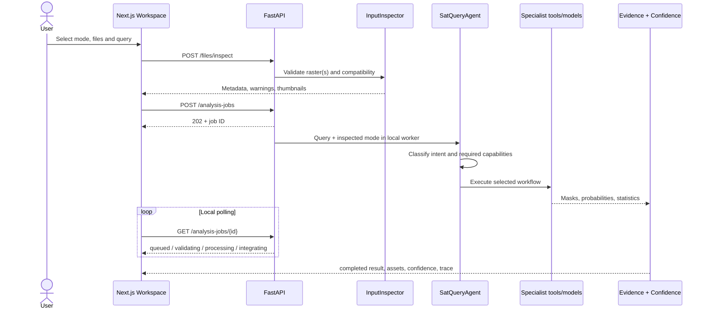
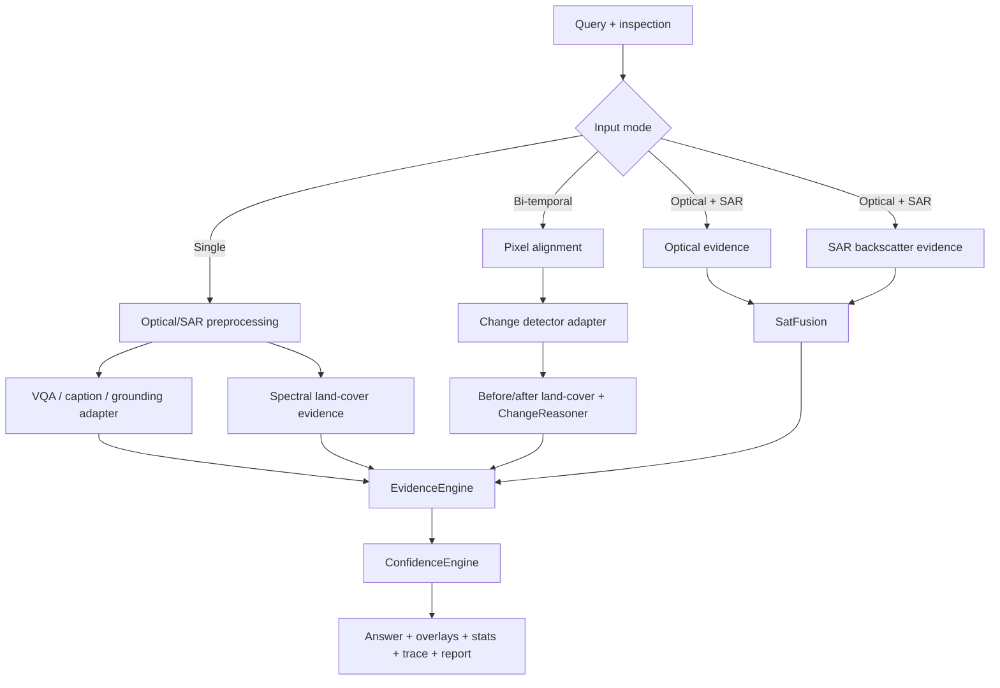

# Architecture

## Runtime surfaces

The Next.js client owns upload selection, raster metadata presentation, Leaflet visualization, assistant interaction and local report opening. The FastAPI server owns all filesystem access, validation, routing, analysis, evidence assets, confidence, history and model status.

## Agent contract

`SatQueryAgent` does not contain model-specific inference. It delegates to `AnalysisService`, which uses `QueryInterpreter`, `ModelRegistry`, `ToolRegistry`, modality-specific preprocessing, and the confidence/change reasoners. This preserves the API when a deterministic baseline is replaced by GeoChat, RemoteCLIP, ChangeFormer or a trained SatFusion head.

Only observable execution facts are returned: task, input mode, selected models/baselines, tools, parameters, step runtimes, status and warnings. Internal chain-of-thought is neither recorded nor exposed.

## Pipelines

Large rasters are not reduced to a single 1024-pixel analysis image. `TileWindow` creates overlapping full-resolution windows, each specialist produces tile-space probabilities, and weighted stitching restores them to source coordinates. Preview images are downsampled independently for the browser. Paired georeferenced rasters use Rasterio reprojection onto the first raster's CRS, affine grid and resolution; unreferenced inputs use an explicitly reported pixel-space resize fallback.

## Local job lifecycle

The in-process `AnalysisJobService` serializes memory-heavy runs through a single local worker. It exposes `queued`, `validating`, `loading_model`, `processing`, `integrating`, `completed`, and `failed` states without Redis or Celery. Upload copies remain request-scoped until their job finishes and are then removed in all success/failure paths. Completed results remain durable through history JSON and evidence assets.

## Storage

`data/uploads`, `outputs`, `reports`, `history` and `temp` are local and ignored. Analyses use UUIDs. History stores structured result metadata and asset references rather than duplicating original rasters. Uploaded files are never executed.

## Model lifecycle

Device priority is CUDA → Apple MPS → CPU, with an environment override. Registry entries report checkpoint readiness. The adapter boundary defines `load`, `unload`, `predict`, `health` and `metadata`. Large learned adapters can be loaded lazily and unloaded after each request.
