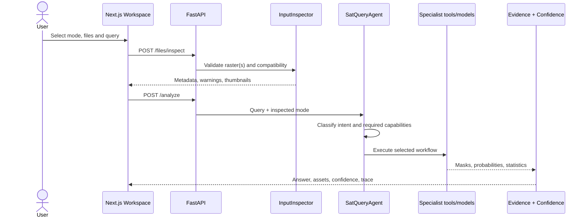
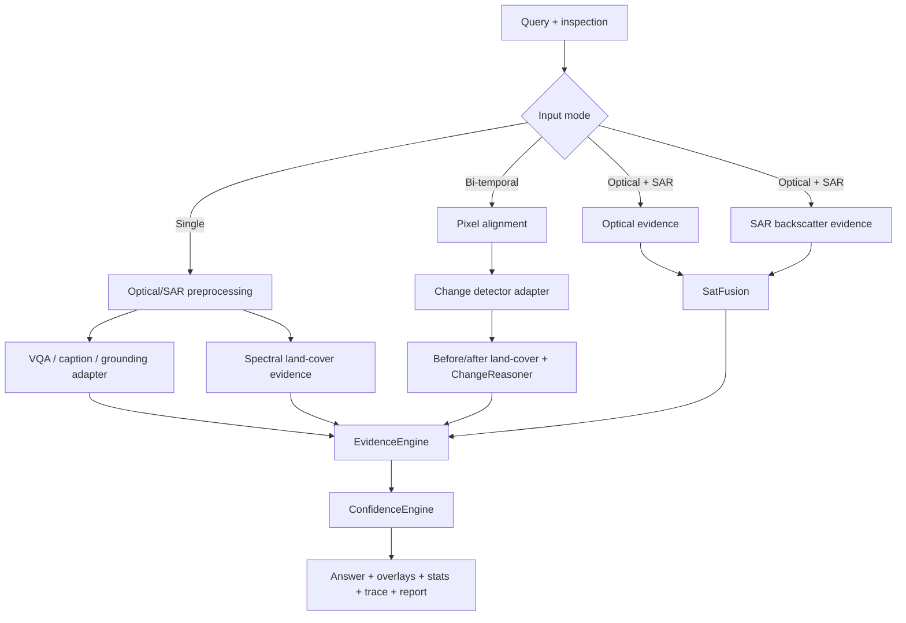

# Architecture

## Runtime surfaces

The Next.js client owns upload selection, raster metadata presentation, Leaflet visualization, assistant interaction and local report opening. The FastAPI server owns all filesystem access, validation, routing, analysis, evidence assets, confidence, history and model status.

## Agent contract

`SatQueryAgent` does not contain model-specific inference. It delegates to `AnalysisService`, which uses `QueryInterpreter`, `ModelRegistry`, `ToolRegistry`, modality-specific preprocessing, and the confidence/change reasoners. This preserves the API when a deterministic baseline is replaced by GeoChat, RemoteCLIP, ChangeFormer or a trained SatFusion head.

Only observable execution facts are returned: task, input mode, selected models/baselines, tools, parameters, step runtimes, status and warnings. Internal chain-of-thought is neither recorded nor exposed.

## Pipelines

## Storage

`data/uploads`, `outputs`, `reports`, `history` and `temp` are local and ignored. Analyses use UUIDs. History stores structured result metadata and asset references rather than duplicating original rasters. Uploaded files are never executed.

## Model lifecycle

Device priority is CUDA → Apple MPS → CPU, with an environment override. Registry entries report checkpoint readiness. The adapter boundary defines `load`, `unload`, `predict`, `health` and `metadata`. Large learned adapters can be loaded lazily and unloaded after each request.
